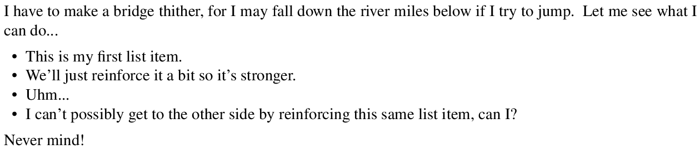
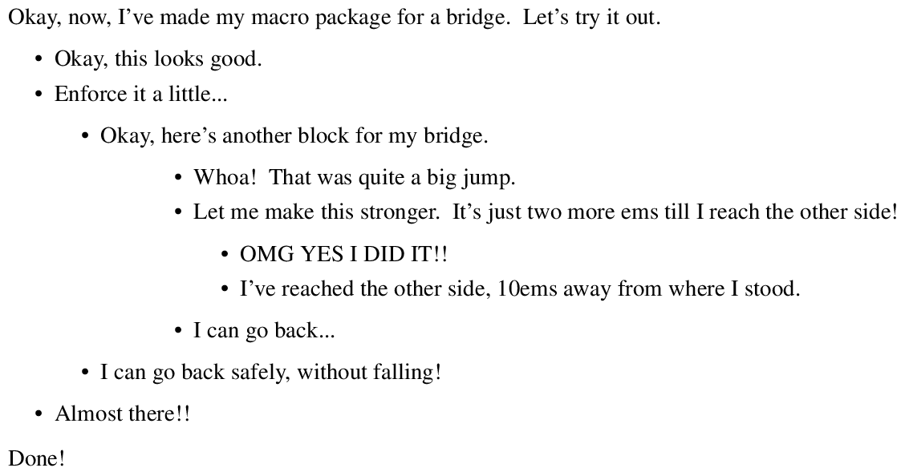

==========
lists.tmac
==========
------------------------------------------------
A macro package for well-typeset lists in TROFF
------------------------------------------------

Introduction
============
*lists.tmac* (*lists dot troff macros*) is the name of this macro package for
TROFF.  This macro package aims to facilitate exceptionally-beautiful
typesetting of bulleted lists (lists of points) and totally ordered lists
(numerical or lexicographical lists) in TROFF.  The entire macro package is
completely free and open-source and is completely written in TROFF from ashes to
stones.

To further its abilities, it aims to provide utmost customizability, control,
and freedom in the typeset output, whilst also providing convenience and basic
failure-correction in most general cases.  Following the UNIX philosophy, it
aims to do one thing and do it very well: lists.  All the documentation aims to
be as precise and detailed as possible.

Given these goals, *lists.tmac* currently fulfills everyone of them, all
*except* for the facilities to typeset totally ordered lists, which is a
challenging endeavour.

What the fuck?!
===============
Did you take a peek at ``stack.tmac`` and throw up?  Don't worry, you're not the
only one.  The functionality, capability, and flexibility of *lists.tmac* relies
heavily on the concept of stacks.  There are so many stacks being used, and as
such, certain concepts from object-oriented programming in JavaScript have been
implemented.  Since *lists.tmac* is written in pure 100% TROFF, all of that is
written entirely from scratch in TROFF.

With that said, *lists.tmac* literally has array-like capabilities, array
objects with methods, and an array class.  You can derive it for your own use if
you want.  All this is pushing TROFF implementations to their limits.  It got so
complex that some features of *lists.tmac* had to be rejected as the TROFF
compiler began to act in a weird manner when it clearly shouldn't.

Compatibility
=============
*lists.tmac* is highly compatible with GNU TROFF (GROFF) version circa 1.22.2 or
newer.  It is a really unlikely that it will work with other implementations of
TROFF, especially classical AT&T TROFF.  Given the ubiquity of GNU TROFF and the
fact that nobody uses AT&T TROFF anymore, this should not be too much of a
problem.

To prevent misuse, *lists.tmac* reacts nastily if it realizes that it is not
being run in GNU TROFF.  It prints an error message labelled \``FATAL'' and ends
all text processing abruptly.  That's nasty!  If you want to override its
fail-safe, run ``.nr .g 1`` before you source *lists.tmac* into your document.

As for the macro package's compatibility with the user, i.e. the prerequisites
demanded from you, then it isn't much.  You need only know how to use one of the
popular macros in TROFF, even *-mom* will do.  Then, you'll be able to use
*lists.tmac* easily.  If you want to debug and play around with the code or see
how the macro package works, then you may need a bit of experience, obviously.

Installation
============
Copy ``*.tmac`` within this repository to your ``site-tmac`` directory, which
should be in ``/usr/share/{,local}/groff/site-tmac`` for GROFF installations.

Usage
=====
See `manual.pdf <manual.pdf>`_.  This is a comprehensive manual that documents
every nook and cranny of the macro package.  If new features are added, changes
will be reflected.

To use the macro package after installation, this should be the first line of
your document:

.. code:: nroff

  .mso lists.tmac

If you prefer to learn by examples (which are inherently incomplete), refer to
`test.pdf <test.pdf>`_ or see the examples in `Motivation`_.

By the way, if you are viewing `test.pdf <test.pdf>`_ from within Github, you
might **not** see bullet points for each item even though they are there.  Just
download the PDF and view it with a good viewer.  I've been using Zathura_ to
view PS and PDF and it renders Troff output quite nicely.

.. _Zathura: https://pwmt.org/projects/zathura/

FAQ
===
What is TROFF?  What is a macro package?  What is a TMAC?
---------------------------------------------------------

TROFF
  A typesetting program that is an ancestor of LaTeX.  It is a program that
  reads lines of text from a text file and tries to put it nicely on paper.  The
  result generally looks good.  For more information, see http://troff.org.

Macro package
  A macro package for TROFF is a collection of macros for TROFF.  Macros can do
  many things to help you with typesetting your documents.  Macro packages are
  simply bundles of those macros and are given nice names like *lists.tmac*.

TMAC
  TMAC (TROFF Macro) files are TROFF files that contain macros definitions for
  TROFF.  TMAC files look like ``lists.tmac`` or ``me.tmac``.

Make sure you know what TROFF is before trying to use *lists.tmac*.

Will you make one for LaTeX?
---------------------------
Well, I don't know how to LaTeX and LaTeX already has a facility for
well-typeset lists, so it's highly unlikely I will be implementing this in
LaTeX.

Motivation
==========
*lists.tmac* was written out of the need for more complex structures of lists,
both bulleted and totally ordered ones.  Though, it started off with the need
for complex bulleted lists first, which were in high demand and less of a
challenge than totally ordered lists.

Once came upon a time, a writer sat at her computer, typesetting some
documentation for a computer science project using TROFF and the *-me* macros.
As she started the abstract and the introductory portions of the document, all
was fine and dandy; paragraphs, figures, blockquotes, titles, and some basic
lists were set very well.  And so, she kept on keeping on with her work...

One day, as she ventured further into the journey of writing, she stumbled upon
a cliffedge, whereupon the other side lies yet another cliffedge with a writing
idea hanging by its tip, 10 ems away from this cliffedge.  She then realized
that the only way to bridge those two cliffedges together was to construct
bulleted lists with nested bulleted lists upon nested bulleted lists until she
could reach for that idea on the other side and carry on.

Unfortunately, the facility of bulleted lists provided by the *-me* macros could
only do so much:

.. code:: nroff

  .lp
  I have to make a bridge thither, for I may fall down the river miles below if
  I try to jump.
  Let me see what I can do...
  .bu
  This is my first list item.
  .bu
  We'll just reinforce it a bit so it's stronger.
  .bu
  Uhm...
  .bu
  I can't possibly get to the other side by reinforcing this same list item, can
  I?
  .po +10m \" Will my bridge be strong enough?
  .po -10m \" Maybe not.
  .in +10m \" This might work...
  .in -10m \" But, I'm afraid of heights!
  .lp
  Never mind!

After some thoughts and brainstorming, she recalls an ability that
reStructuredText posesses.  She has a very keen recollection of
reStructuredText's beautifully nested lists and how well they conincide with
other facilities it provides.  She knows this as she had been doing a bit of
writing work in reStructuredText before!

- This is an example of a bulleted list in reStructuredText.

  - Bulleted lists can extend to many nested orders, like this one.

    - And this one!

      One can even have a paragraph therewithin.

  - One can add further points, yet again.

    - It can expand to more points too.

      - Like this.

- And abruptly come back to the first nested order as desired.

To get to the cliffedge on the other side, she gets her inspiration from
reStructuredText's lists and also concocts new features to add to it as well.
And so she decided to put this ability into a macro package that works well and
can be used within TROFF, which means that she can use it again effectively
should she find another cliffedge like this one.

.. code:: nroff

  .lp \" 0ems from origin.
  Okay, now, I've made my macro package for a bridge.
  Let's try it out.
  .{b 2m \" 2ems from origin.
  .bb
  Okay, this looks good.
  .bb
  Enforce it a little...
  .{b 2m \" 4ems from origin.
  .bb
  Okay, here's another block for my bridge.
  .{b 4m \" 8ems from origin.
  .bb
  Whoa!
  That was quite a big jump.
  .bb
  Let me make this stronger.
  It's just two more ems till I reach the other side!
  .{b 2m \" 10ems from origin.
  .bb
  OMG YES I DID IT!!
  .bb
  I've reached the other side, 10ems away from where I stood.
  .}b \" 8ems from origin.
  .bb
  I can go back...
  .}b \" 4ems from origin.
  .bb
  I can go back safely, without falling!
  .}b \" 2ems from origin.
  .bb
  Almost there!!
  .}b \" 0ems from origin.
  .lp
  Done!

After stringent strength-testing and all that, she managed to cross the other
side of her own bridge, never to fear another cliff again!

The End.  In the soon-to-come second part of Stephanie's hypothetical journey,
she must get to the other side of a more complicated cliff, but she cannot do it
with just nested orders of bulleted lists!  She must construct a numbered list
quickly, to break the spell of an evil witch!

Bugs
====
Direct complaints to `Author`_.

Author
======
I'm Stephanie Björk or Katt.  You can email me at katt16777216@gmail.com and I
should reply within 1-3 days at best.

If you desire faster replies, i.e. within a matter of minutes or hours, add me
on Snapchat: ``suttiwit``.  If you send nudes or selfies, you will be blocked
permanently.

License
=======
See `LICENSE <LICENSE>`_.
