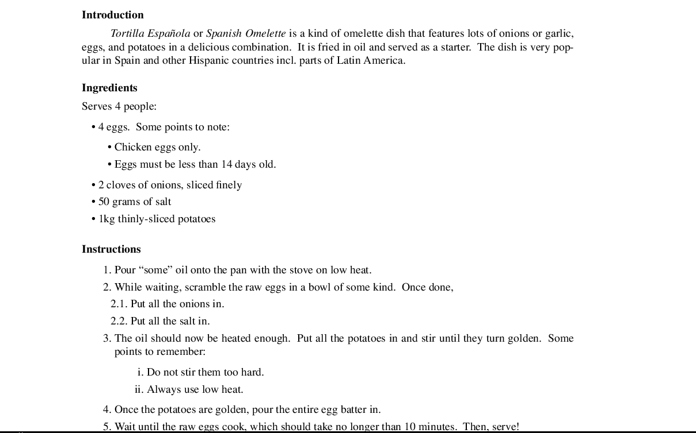

=================
lists.tmac
=================
---------------------------------------------------------------
A macro package for exceptionally well-typeset lists in Troff.
---------------------------------------------------------------

Introduction 👋
===============
*lists.tmac* provides facilities to typeset exceptionally beautiful lists within
modern implementations of Troff.  It integrates very well with the existing
*-me* macro package and aims to do one thing and do it well -- lists.  In this
article, all occurences of the word "infinite," "infinitely," and "infinity" are
metaphoric.

*lists.tmac* currently provides lists of the following types: bulleted (i.e.
unordered) or lexicographically-ordered (i.e. totally ordered).  Each of these
types can be nested infinitely.  Bulleted lists can have infinite nestings and
totally ordered lists can have infinite depths and infinite nestings as well.
The two types of lists can also be nested within one another and used alongside
each other seamlessly.

Information pertaining to each depth or nesting is internally stored into a
system of stacks automatically.  This feature is necessary as *lists.tmac* is
highly customizable.  Indentations, vertical spacings, and other fine aspects of
a particular nested list order can be arbitrarily and unpredictably defined by
the writer.  When such a nested order must be exit from, the macro package
"remembers" those settings for each nested list, and exdents accordingly to give
the document a symmetric, eye-pleasing look.

Lists typeset by *lists.tmac* take inspiration from reStructuredText's lists,
which can be nested to infinitely high orders, have paragraphs within a list
item, and have infinitely many depths and lexicographical-ordering of any
totally ordered set (for ordered lists).  The macro package aims to implement
and extend further from this by providing customizability and other more
sophisticated options amongst all else.  Whilst providing a high degree of
customizability, it also tries to be convenient and easy-to-use by providing
output suitable for most cases by default without any customization or
interventions, and also provide some error-correction facilities to get out of
sticky situations.

The general target audience of this macro package is writers and people who like
typesetting.  They may be at a beginner-level in Troff and UNIX and they may not
have even touched a single line of code or computer logic.  However, it can be
used freely by anybody!

The macro package does not work on the classical AT&T or Bell Labs Troff, the
two of which are not really popular these days anyway.  It does work on modern
and popular implementations of Troff, such as GNU Troff and Heirloom Troff.

Nonetheless, a `manual <manual.me>`_ is provided, which describes the macro
package formally, and details the prerequisites, compatibilities, usage, and
caveats.  It also showcases some of the best things *list.tmac* can provide --
lists!  Generally speaking, good software comes with good documentation, so
the documentation aims to be very good and detailed.  Many of the points stated
here will be stated again in equal or greater verbosity within the typeset
manual.  You should definitely check that manual out!

Interested? 😊
==============
If you know some Troff, are interested in this macro package, and want to give
it a spin, then feel free to clone this repository::

  git clone https://github.com/katt64/lists.tmac

and compile `manual.me <manual.me>`_ by yourself::

  groff -Tpdf -Kutf8 -me -e manual.me > manual.pdf

I'll let you compile it by yourself so as to see how interested you are in this.
:p  Haha, just kidding...  Doesn't it feel great to compile things yourself,
though?

An example
==========
The following is a very simple example of a common listing application this
macro package can help with.  This section is divided into three subsections: an
example in reStructuredText (from which inspiration for *lists.tmac* took
place), an example of the output in Troff, and the Troff source code that uses
*lists.tmac* for those lists.

In reStructuredText
-------------------
Introduction
~~~~~~~~~~~~
Tortilla  Española  or  Spanish  Omelette  is a kind of
omelette dish that features lots of onions or garlic,  eggs,
and potatoes in a delicious combination.  It is fried in oil
and served as a starter.  The dish is very popular in  Spain
and other Hispanic countries incl. parts of Latin America.

Ingredients
~~~~~~~~~~~
Serves 4 people

- 4 eggs.  Some points to note:

  - Chicken eggs only.
  - Eggs must be less than 14 days old.

- 2 cloves of onions, sliced finely

- 50 grams of salt

- 1kg thinly‐sliced potatoes

Instructions
~~~~~~~~~~~~
1. Pour “some” oil onto the pan with the stove on low heat.

2. While  waiting,  scramble the raw eggs in a bowl of some
   kind.  Once done,

   2.1. Put all the onions in.

   2.2. Put all the salt in.

3. The oil should now be heated enough.  Put all the  potatoes
   in and stir until they turn golden.  Some points to
   remember:

   1. Do not stir them too hard.

   2. Always use low heat.

4. Once the potatoes are golden, pour the entire egg batter
   in.

5. Wait  until	 the  raw  eggs	 cook,	which should take no
   longer than 10 minutes.  Then, serve!

In Troff
--------

Source file in Troff
~~~~~~~~~~~~~~~~~~~~
.. code:: nroff

  .mso lists.tmac
  .uh Introduction
  .pp
  .i "Tortilla Española"
  or
  .i "Spanish Omelette"
  is a kind of omelette dish that features lots of onions or garlic, eggs, and
  potatoes in a delicious combination.
  It is fried in oil and served as a starter.
  The dish is very popular in Spain and other Hispanic countries incl. parts of
  Latin America.
  .uh Ingredients
  .lp
  Serves 4 people:
  .{b
  .bb
  4 eggs.
  Some points to note:
  .{b
  .bb
  Chicken eggs only.
  .bb
  Eggs must be less than 14 days old.
  .}b
  .bb
  2 cloves of onions, sliced finely
  .bb
  50 grams of salt
  .bb
  1kg thinly-sliced potatoes
  .}b
  .uh Instructions
  .{o
  .oo
  Pour \*(lqsome\*(rq oil onto the pan with the stove on low heat.
  .oo
  While waiting, scramble the raw eggs in a bowl of some kind.
  Once done,
  .oo 2
  Put all the onions in.
  .oo
  Put all the salt in.
  .oo 1
  The oil should now be heated enough.
  Put all the potatoes in and stir until they turn golden.
  Some points to remember:
  .{o i
  .oo
  Do not stir them too hard.
  .oo
  Always use low heat.
  .}o
  .oo
  Once the potatoes are golden, pour the entire egg batter in.
  .oo
  Wait until the raw eggs cook, which should take no longer than 10 minutes.
  Then, serve!
  .}o

Bugs 🐛
=======
There are currently no known bugs within the macro package.  However, if there
are bugs, please do make an effort to report them to `Issues
<https://github.com/katt64/lists.tmac/issues>`_, no matter how trivial, whence
the maintainers can address them.  However, do be sure you are running the
latest version of the macros before reporting bugs.

Bug reports can be however trivial they must be, but keep in mind that they must
be detailed enough such that the maintainers know what exactly is going on.
Therefore, it is generally recommended to include the following things in your
bug report in the following order:

1. The abstract of the problem you are facing.  For example:
  
    Bulleted lists are suddenly not nesting properly after 37 nested orders on
    the 2nd and 3rd items of the list.

2. The Troff source text that clearly exemplifies and isolates the bugs.  The
   bugs should be reproducible given this mere excerpt.  Doing this isolation is
   useful so that it is not necessary to show your entire document to the public
   and it is easy for the maintainers to look for the bugs without getting too
   distracted.  For example:

   .. code:: nroff

    .{b \(mu
    .bb
    This is nesting well.
    .bb
    This is not; the margin falls back.
    .bb
    This is not doing well either.
    .bb
    This is okay.  Strange!
    .}b

3. The backtrace of the macro package's operation on the excerpt from No. 2.
   This is very useful so it is further known what's going on whilst the
   document and the list is being compiled and typeset onto the page.  A
   very good backtrace can be printed to the Standard Error stream by adding the
   following lines **after** the line to source the macro package.  So, the top
   of the example excerpt from No. 2 should look like this:

   .. code:: nroff

    .mso lists.tmac
    .nr trace-full 1
    .mso trace.tmac
    .{b
    .bb
    This is nesting well.

   You may be asked to put the two lines (``.nr trace-full 1`` and ``.mso
   trace.tmac``) **before** the line to source the macro package (``.so
   lists.tmac``).  If that's the case, you may want to do that.

4. The name and version of your Troff compiler, and related environment factors
   such as fonts, font sizes, page sizes, even the operating system, &c.  This
   could be helpful.  For example:

    I'm running GNU Troff version 1.22.2 on Gentoo Linux x86_64.  I'm using
    Merriweather size 10 on 12.  The paper size is US Letter.  I'm also using
    EQN and TBL for equations and tables respectively.

All this information could be very useful in hunting down bugs and finding the
root cause of the problem.  Remember to collect all you can!  This section will
be mentioned again in the typeset manual.

Authors 😘
==========
This project is currently a one-person effort by Stephanie Björk, a 17-year-old
high school student interested in computer science and the UNIX
programming/typesetting environment.  She's kind of busy.

She (I) can be contacted by email: katt16777216@gmail.com which is checked once
every few days.  If very fast replies are expected, add me on Snapchat,
``suttiwit``, and expect a reply within a few hours at worst.  **Do not** send
nudes or selfies unless you want to get blocked permanently.

I appreciate you sending me questions, comments, enquiries, or thanks about this
project.  I would appreciate it even more if you could offer some help to
maintain this repository.  If you offer help, do mention your background and
what interests you about this project, then we can certainly have a chat about
it and you could very well be one of the maintainers!

License 😏
==========
*lists.tmac* is licensed under the 4-clause BSD license.  Unlike the 3- or
lesser- clause BSD licenses, you must explicitly state that the software is used
and provided by me (jeez, I'm such a bitch) in all advertising materials that
mention the features or use of this software.  See `LICENSE <LICENSE>`_ for more
details.
